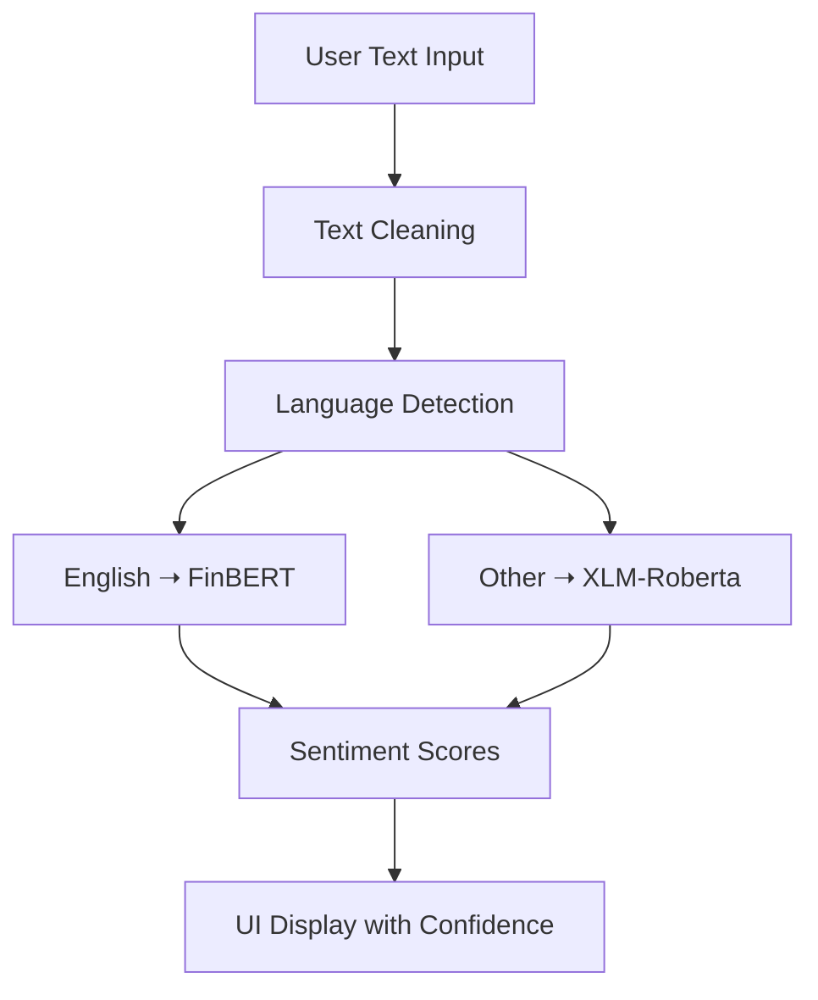

# 💹 Financial News Analyzer with Transformers and XAI

> This project is a comprehensive NLP pipeline designed to perform sentiment analysis on financial news across multiple languages. We integrated preprocessing, data augmentation, class balancing, multilingual modeling, and explainability — all packed into an interactive and easy-to-use interface.

---

## 🧠 Project Motivation

Financial news headlines are short, high-impact, and often emotionally charged. Traders and investors rely on such information to make quick decisions — but what if we could automatically **interpret the sentiment** of these headlines?

This project answers that question by building a sentiment analyzer capable of:
- Understanding **English** financial texts using **FinBERT**  
- Handling **non-English** texts using **XLM-Roberta**
- Preprocessing, balancing, and interpreting text inputs effectively
- Explaining model decisions using **XAI methods**

---

## 🧾 Dataset Overview

We worked with multiple CSV files containing financial news headlines and their labeled sentiments. These were preprocessed, merged, and augmented to ensure a rich and balanced dataset for training and evaluation.

📁 **Final dataset:** `final_augmented_stock_sentiment.csv`  
📈 **Classes:** `positive`, `neutral`, `negative`

To correct class imbalance, we applied:
- **SMOTE** for rare classes
- **Random oversampling** for majority classes (see `duplicating.py`)

---

## 🧹 Text Preprocessing

Before any modeling, we ensured that the input text was **cleaned and standardized** using the following steps:

- Lowercasing all characters  
- Removing punctuation, special characters, newlines, and extra spaces  
- Using `nltk` for optional stopword removal

📄 Code reference: `finbert.py → clean_text()` function

---

## 🌍 Multilingual Support

Real-world financial news isn’t limited to English — and neither is our model.

- For **English** headlines, we used [`yiyanghkust/finbert-tone`](https://huggingface.co/yiyanghkust/finbert-tone), a domain-specific BERT model trained on financial texts.
- For **non-English** headlines, we used [`cardiffnlp/twitter-xlm-roberta-base-sentiment`](https://huggingface.co/cardiffnlp/twitter-xlm-roberta-base-sentiment), a multilingual sentiment model.

We automatically detect the input text language using `langdetect`, then route the sentence to the appropriate model.

---

## 🤖 Model Pipeline

Here’s a full breakdown of the prediction workflow:

1. **Text Input:** The user enters a financial news headline.
2. **Cleaning:** The input is processed using regex and `nltk`.
3. **Language Detection:** `langdetect` identifies whether the sentence is in English.
4. **Model Routing:**
   - English → FinBERT
   - Non-English → XLM-Roberta
5. **Prediction:** The model returns a probability score for each class (positive, neutral, negative).
6. **Display:** The result is shown in a user-friendly interface.

---

## 🧩 Project Flow Diagram

## 📈 Example Predictions

The model doesn't just return a sentiment — it gives you a **confidence score** and an **automatic tag** that classifies the type of news:

### 🗞️ Batch Input Example

| News Headline | Sentiment | Confidence | Auto Tag |
|---------------|-----------|------------|----------|
| Tesla's Q1 earnings break records | Positive | 98% | ℹ️ Informational |
| Oil prices fall amid global demand fears | Negative | 74% | ⚠️ Risk Alert |
| Central bank to announce policy decision | Neutral | 86% | ℹ️ Informational |

### 📊 Sentiment Confidence Trend Graph

Each bar represents the **model's confidence in its decision** for each headline.  
- 🟥 Red bars highlight **lower certainty**  
- 🟦 Blue bars represent **strong confidence**

### 🏷️ Auto Tags for Headlines

The system also generates automatic tags (Informational, Risk Alert, etc.) that can help categorize the headline type.  
This adds a **second layer of interpretation** beyond basic sentiment.

---

## 🖥 Interface & Deployment

The project includes a simple and intuitive interface built with **Gradio**, allowing users to interact with the model in real time.

You can:
- 💬 Enter **a single headline**
- 📄 Upload a **batch of news headlines** via CSV
- 📈 Visualize confidence scores and tag outputs immediately

### 💡 Interface Preview

- The left panel takes your input  
- The right panel returns:
  - Predicted sentiment  
  - Confidence level  
  - Automatically generated tag (Informational, Risk Alert…)

It also features real-time charting to **track overall sentiment trends**, making this tool not just a classifier — but a **mini sentiment dashboard**.

## 📦 Technologies Used

- 🤗 **transformers** — for loading FinBERT and XLM-Roberta models  
- 🌐 **langdetect** — automatic language detection to route text to the correct model  
- 🔠 **nltk**, `re`, `string` — for natural language preprocessing (tokenization, cleaning, etc.)  
- ⚖️ **scikit-learn (SMOTE)** — to balance class distribution in the training dataset  
- 📊 **pandas**, **numpy** — for data manipulation and analysis  
- 💻 **gradio** or **streamlit** — for building the interactive user interface
